# Vital: Track, Monitor, Regulate

Vital is a comprehensive app designed to help individuals track and manage their overall health and wellness. While it’s primarily tailored for users who want to monitor their blood pressure—including pregnant women, older adults, and individuals with hypertension—it’s suitable for anyone interested in staying informed about their health.

The app features curated articles from the CDC on blood pressure and general health topics, conveniently displayed on the home screen. Additionally, Vital offers a robust set of tools, including a dashboard for insights, a "medicine cabinet" for tracking medications, and a calendar for managing appointments or journaling health-related events.

## Libraries Used
- **[Compose WebView Multiplatform](https://github.com/KevinnZou/compose-webview-multiplatform)**: Providing basic webview functionalities. Used for tha article cards on the welcome screen.
- **[Koala Plot](https://github.com/KoalaPlot/koalaplot-core)**: A library for data visualization, used for the blood pressure graphing.
- **[Compose Multiplatform Date Time Picker](https://github.com/Chaintech-Network/compose_multiplatform_date_time_picker)**: A Compose-based date-time picker. Used for scheduling appointments.
- **[UUID](https://github.com/benasher44/uuid)**: A library for generating UUIDs. Used for generating unique IDs to add or delete items.
- **[Spotless](https://github.com/diffplug/spotless)**: Code formatting plugin.

## Architecture of the App
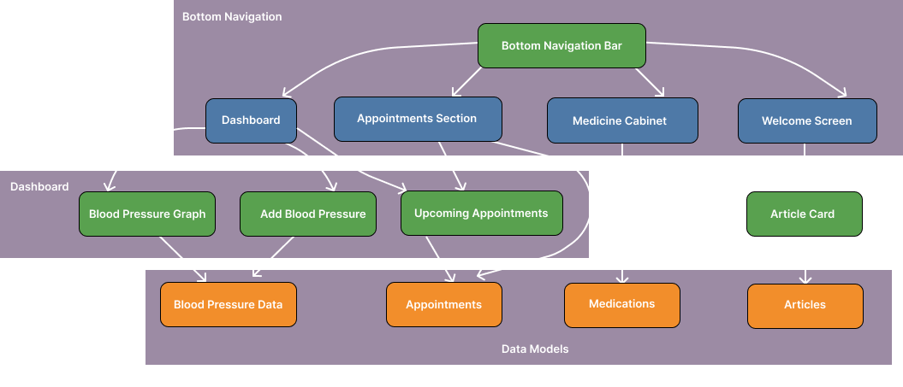

## Screens
- **Appointments**: Dialog for adding a new appointment, including time using [compose multiplatform date time picker](https://github.com/Chaintech-Network/compose_multiplatform_date_time_picker). Displays a list of appointments with a weekly calendar view and lists appointment items with a weekly calendar header.

- **Blood Pressure**: Shows a dot graph of blood pressure trends with [koala plot](https://github.com/KoalaPlot/koalaplot-core), and allows users to log new blood pressure readings.

- **Medications**: Dialog for adding or editing medications with a component for displaying medication details. The overall screen lists all medications.

- **Welcome**: Adds a navigation button to the dashboard. Has article cards that link to CDC articles using [compose WebView multiplatform](https://github.com/KevinnZou/compose-webview-multiplatform).

- **ViewModels**: Contains the logic and state management for the app's features. `HealthComponent.kt` is a centralized health-related state management.

## Set up the environment

> **Warning**  
> You need a Mac with macOS to write and run iOS-specific code on simulated or real devices. This is an Apple requirement.

> **Note**: The installation instructions below are adapted from [this repository](https://github.com/KevinnZou/compose-multiplatform-sample/blob/main/README.md).

To work with this template, you need the following:

- A machine running a recent version of macOS
- [Xcode](https://developer.apple.com/xcode/)
- [Android Studio](https://developer.android.com/studio)
- The [Kotlin Multiplatform Mobile plugin](https://plugins.jetbrains.com/plugin/14936-kotlin-multiplatform)
- The [CocoaPods dependency manager](https://kotlinlang.org/docs/native-cocoapods.html)

## Run the application

## On Android
To run your application on an Android emulator:

1. Ensure you have an Android virtual device available. Otherwise, [create one](https://developer.android.com/studio/run/managing-avds#createavd).
2. In the list of run configurations, select `androidApp`.
3. Choose your virtual device and click **Run**.

## On iOS

### Running on a simulator

To run your application on an iOS simulator in Android Studio, modify the `iosApp` run configuration:

1. In the list of run configurations, select **Edit Configurations**.
2. Navigate to **iOS Application | iosApp**.
3. In the **Execution target** list, select your target device. Click **OK**.
4. The `iosApp` run configuration is now available. Click **Run** next to your virtual device.

### Running on a real device

You can run your Compose Multiplatform application on a real iOS device for free. To do so, you'll need the following:

- The `TEAM_ID` associated with your [Apple ID](https://appleid.apple.com/).
- The iOS device registered in Xcode.

---

> **Note**: This application is distributed under the License on an "AS IS" BASIS, WITHOUT WARRANTIES OR CONDITIONS OF ANY KIND, either express or implied. See the License for the specific language governing permissions and limitations under the License.

## Screenshots of Vital

### iOS, Android in Youtube Demo above

    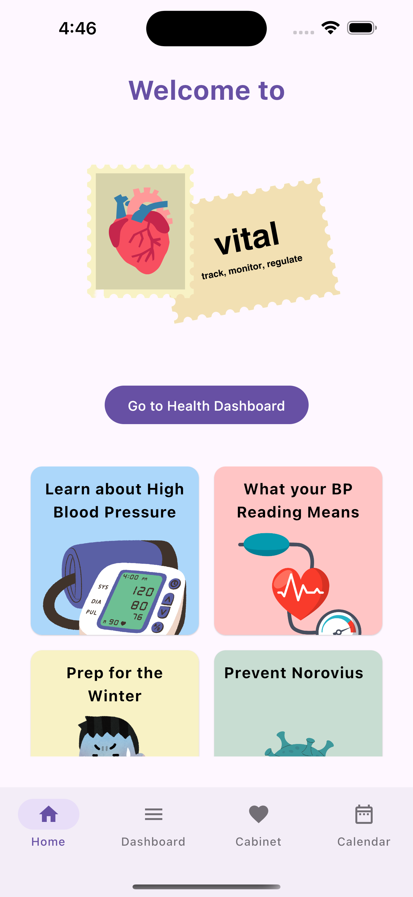
    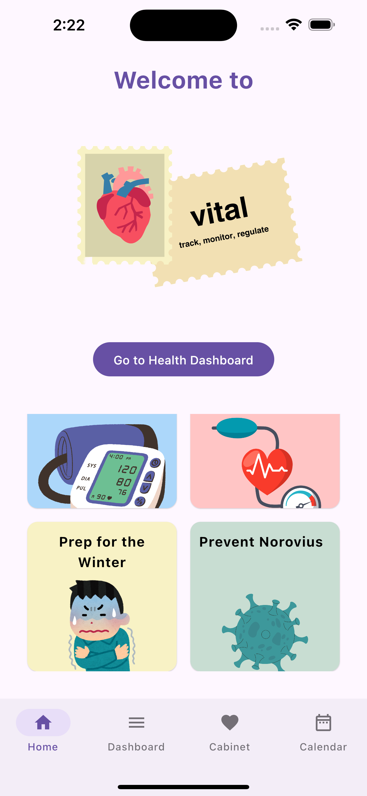
    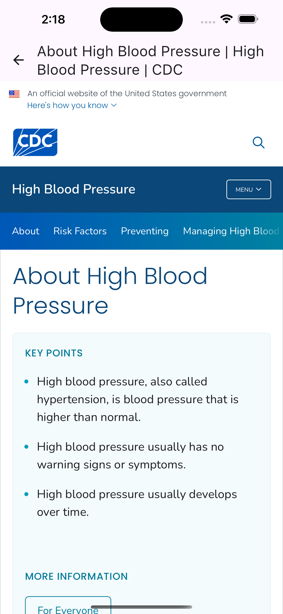

    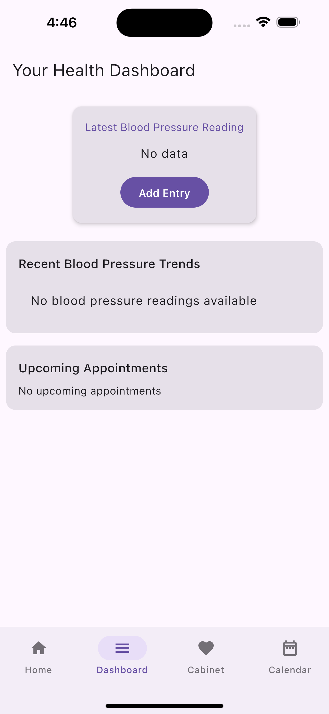
    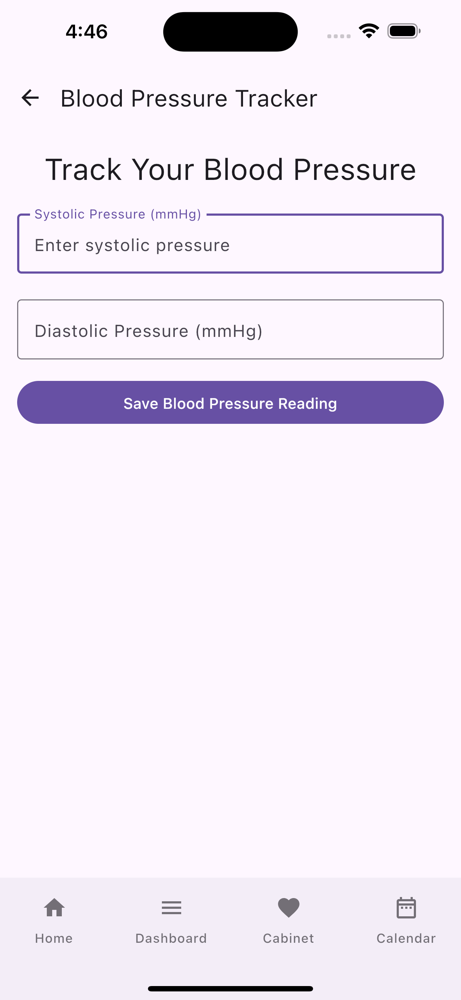
    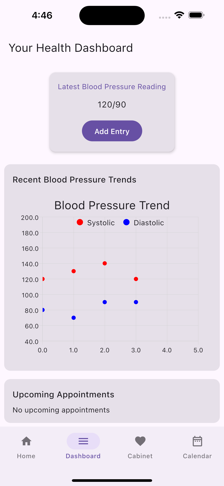

    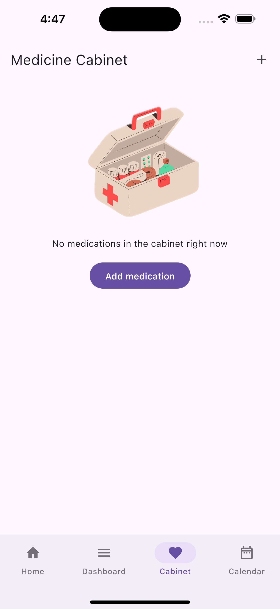
    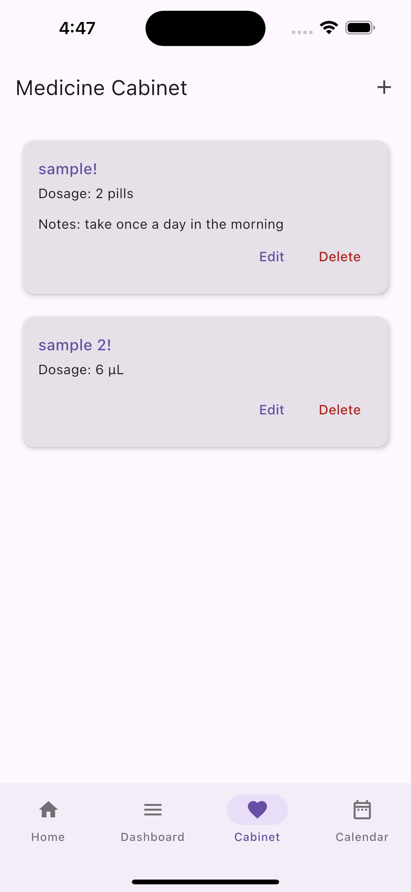
    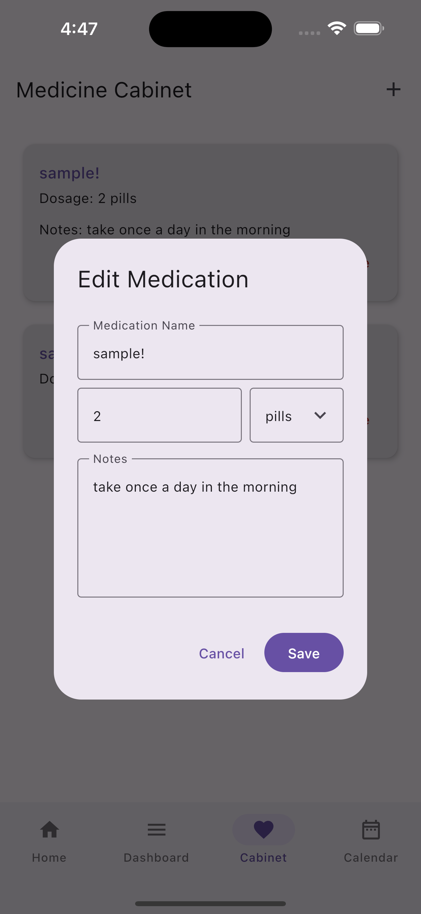

    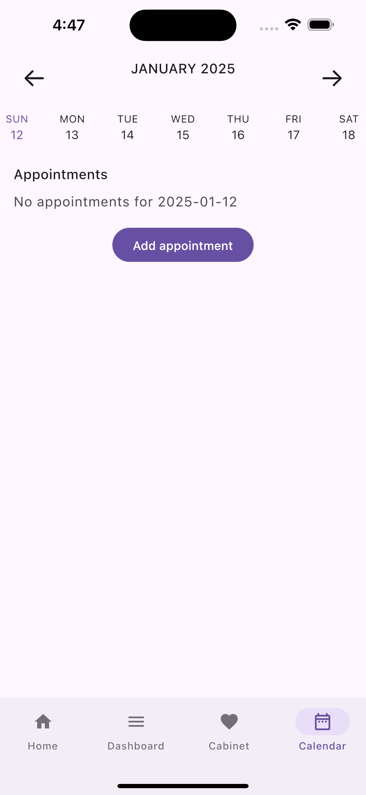
    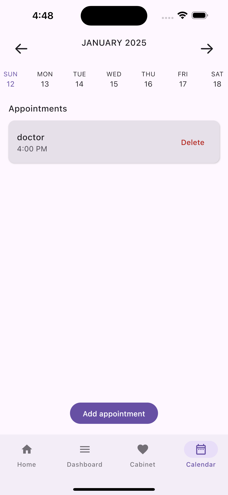
    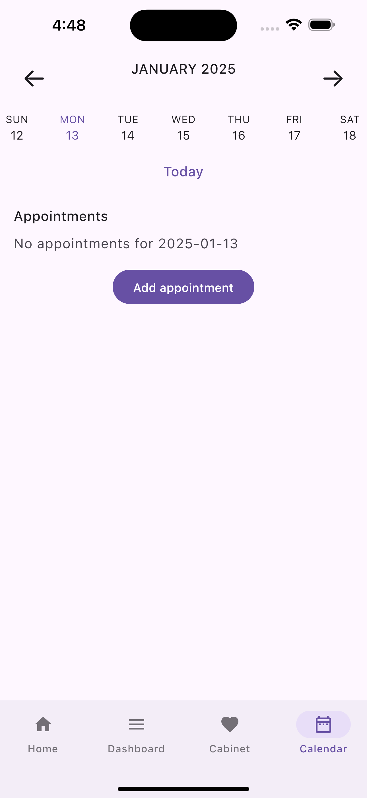

